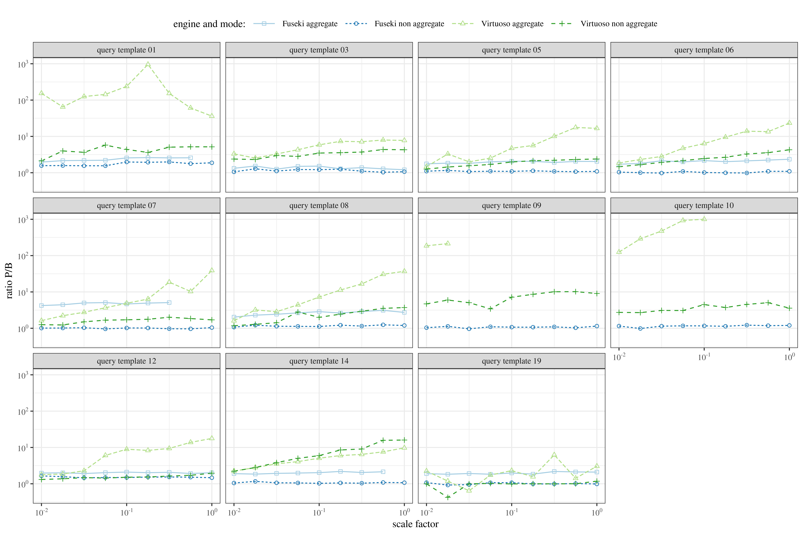

# sparql-prov-tpch

Provenance experiments based on the TPC-H benchmark

## Results

## Execution times

## Overhead of the query rewriting

The following plots illustrate the overhead of the query rewriting,
i.e., the ratios P/B where B is the time of the base query, and P is
the time of the rewritten query.

